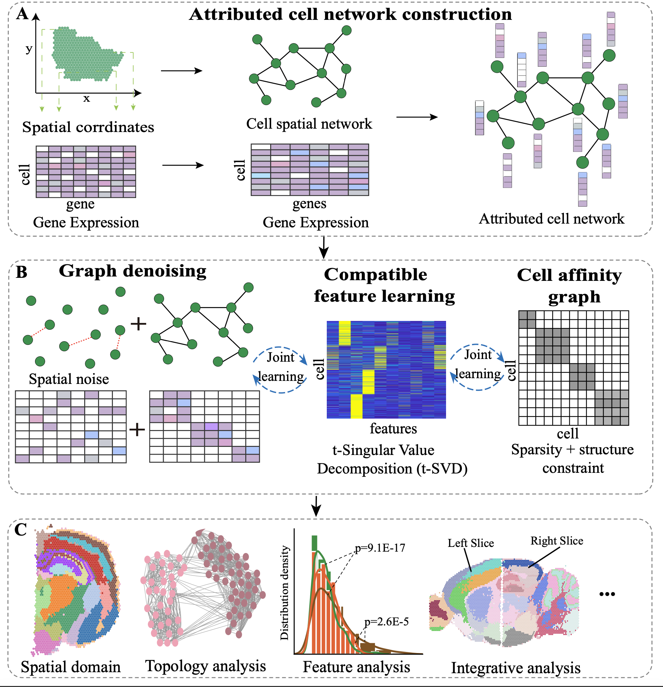

# stACN 

## Bridging denoising and domain identication of spatially resolved transcriptomics with a network-based integrative framework 

### Haiyue Wang, Wensheng Zhang, Shiquan Sun and Xiaoke Ma<sup>*</sup> 

### Contributing authors: xkma@xidian.edu.cn;  

stACN is an attribute cell network model to characterize and identify spatial domains in spatial transcriptomics 
data by integrating gene expression and spatial location information of cells. To fully exploit spatial and expression
information of ST data, stACN simultaneously performs graph denoising and learns compatible features of cells for
expression and spatial information by fully exploiting topological structure of attribute cell network with tensor
decomposition. Then, stACN automatically learns cell affinity graph by manipulating the learned compatible features
of cells with self- representation learning for spatial domain identification. Different from available approaches,
stACN jointly integrates all these procedures such that noise and features of cells are modeled under the guidance
of spatial domains, thereby improving performance of algorithms. Extensive experiments on various ST data from different
platforms and tissues demonstrate the superiority of stANC on spatial domain detection, providing an effective and efficient
model for analyzing ST data.

  

# Installation

#### <font color='red'>To accelerate stACN by using GPU: If you have an NVIDIA GPU (CUDA toolkit supported), be sure to firstly install a version of PyTorch that supports it. When installing stACN without install Pytorch previous, the CPU version of torch will be installed by default for you. Here is the [installation guide of PyTorch](https://pytorch.org/get-started/locally/).</font>

#### 1. Start by using python virtual environment with [conda](https://anaconda.org/):

```shell
conda create --name stacn  python=3.9
conda activate stacn 
pip install stACN
```

(Optional) To run the notebook files in tutorials, please ensure the Jupyter package is installed in your environment:

```shell
conda install -n stacn ipykernel
python -m ipykernel install --user --name stacn --display-name stacn-jupyter
```

## Versions the software has been tested on:

Environment 1:

- Operation System (OS): Linux 5.4.0

- Python: 3.10.12

- Python packages: scanpy=1.9.3, numpy=1.26.4, pandas=2.2.2, anndata=0.10.8, scipy=1.14.0, scikit-learn=1.5.1, torch=2.0.1 (cu118), matplotlib=3.9.1, psutil=5.9.5, tqdm=4.66.4, leidenalg=0.10.2

Environment 2:

- Operation System (OS): Windows 11

- Python: 3.9.19

- Python packages: scanpy=1.10.1, numpy=1.26.4, pandas=2.2.2, anndata=0.10.7, scipy=1.13.0, scikit-learn=1.4.2, torch=2.2.2, matplotlib=3.8.4, psutil=5.9.0, tqdm=4.66.4, leidenalg=0.10.2

## System Requirements

#### Python support packages  (Python$\geq$3.8): 

scanpy, pandas, numpy, scipy, anndata, sklearn, seaborn, torch, leidenalg, tqdm.

<font color='red'>Note:</font> If you encounter the error message "ImportError: Please install the skmisc package via pip install --user scikit-misc" while executing sc.pp.highly_variable_genes(adata, flavor='seurat_v3', n_top_genes=3000), please execute the following command in your terminal:  
``` shell
pip install -i https://test.pypi.org/simple/ scikit-misc==0.2.0rc1.
```
## Tutorial

A jupyter notebook of the tutorial for 10 $\times$ Visium is accessible from :  

https://github.com/xkmaxidian/stACN/blob/master/tuorial/Tutorial1_10x_Visium%20(DLPFC_dataset).ipynb  

The jupyter notebook of the tutorial for installing stACN using pip and identifying spatial domains is accessible from:

(GPU)https://github.com/xkmaxidian/stACN/blob/master/tuorial/Visium_pypi.ipynb
(CPU)https://github.com/xkmaxidian/stACN/blob/master/tuorial/tutorials_stACN.ipynb


## Compared spatial domain identification algorithms

Algorithms that are compared include: 

* [SCANPY](https://github.com/scverse/scanpy-tutorials)
* [Giotto](https://github.com/drieslab/Giotto)
* [BayesSpace](https://github.com/edward130603/BayesSpace)
* [stLearn](https://github.com/BiomedicalMachineLearning/stLearn)
* [SpaGCN](https://github.com/jianhuupenn/SpaGCN)
* [SEDR](https://github.com/JinmiaoChenLab/SEDR/)
* [STAGATE](https://github.com/QIFEIDKN/STAGATE)
* [BASS](https://github.com/zhengli09/BASS)
* [SpaDo](https://github.com/bm2-lab/SpaDo)
* [STMGCN](https://github.com/sxj204/stmgcn)
* [Banksy](https://github.com/prabhakarlab/Banksy_py)
* [MIST](https://github.com/linhuawang/MIST)
* [DIST](https://github.com/zhaoyp1997/DIST)