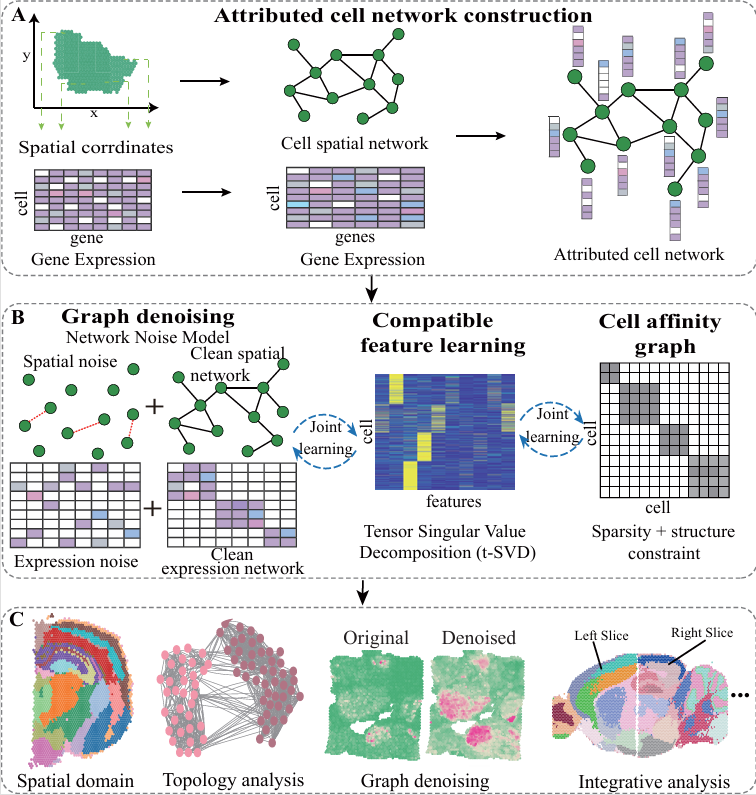

# stACN
> About Attribute Cell Network Model leverages identification of spatial domains from spatial transcriptomics data  

## Learning Topological Structure and Compatible Features of Cell Networks for Spatial Domains with Graph Denoising  

### Haiyue Wang and Xiaoke Ma*    

### Contributing authors: xkma@xidian.edu.cn;  

stACN is an attribute cell network model to characterize and identify spatial domains in spatial transcriptomics 
data by integrating gene expression and spatial location information of cells. To fully exploit spatial and expression
information of ST data, stACN simultaneously performs graph denoising and learns compatible features of cells for
expression and spatial information by fully exploiting topological structure of attribute cell network with tensor
decomposition. Then, stACN automatically learns cell affinity graph by manipulating the learned compatible features
of cells with self- representation learning for spatial domain identification. Different from available approaches,
stACN jointly integrates all these procedures such that noise and features of cells are modeled under the guidance
of spatial domains, thereby improving performance of algorithms. Extensive experiments on various ST data from different
platforms and tissues demonstrate the superiority of stANC on spatial domain detection, providing an effective and efficient
model for analyzing ST data.

  

## System Requirements

#### Python support packages  (Python 3.9.18): 

scanpy, igraph, pandas, numpy, scipy, scanpy, anndata, sklearn, seaborn, torch, leidenalg, tqdm.

For more details of the used package., please refer to 'requirements.txt' file.

## Tutorial

A jupyter Notebook of the tutorial for 10 $\times$ Visium is accessible from :  

https://github.com/xkmaxidian/stACN/blob/master/tuorial/Tutorial1_10x_Visium%20(DLPFC_dataset).ipynb  

## Compared spatial domain identification algorithms

Algorithms that are compared include: 

* [SCANPY](https://github.com/scverse/scanpy-tutorials)
* [Giotto](https://github.com/drieslab/Giotto)
* [BayesSpace](https://github.com/edward130603/BayesSpace)
* [stLearn](https://github.com/BiomedicalMachineLearning/stLearn)
* [SpaGCN](https://github.com/jianhuupenn/SpaGCN)
* [SEDR](https://github.com/JinmiaoChenLab/SEDR/)
* [STAGATE](https://github.com/QIFEIDKN/STAGATE)